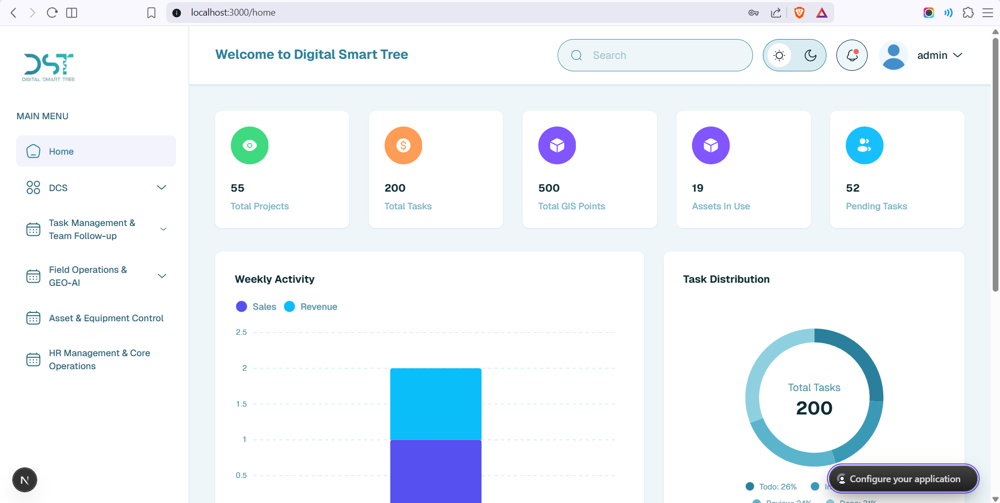
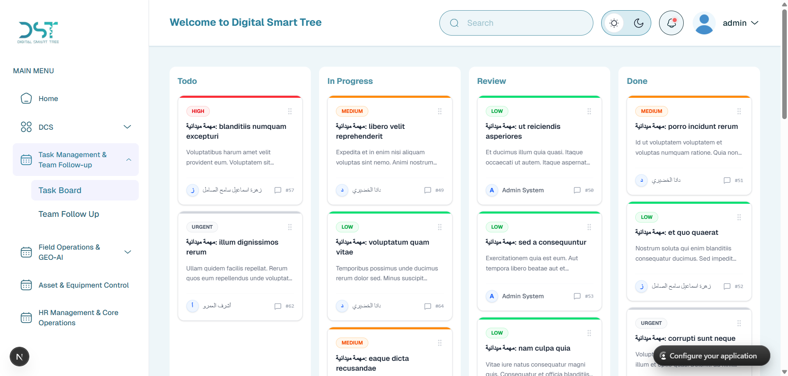
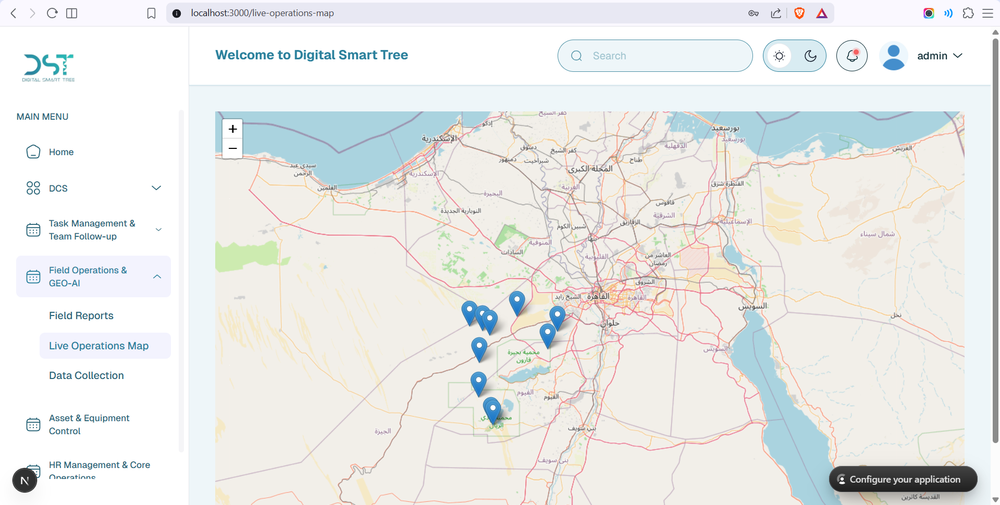
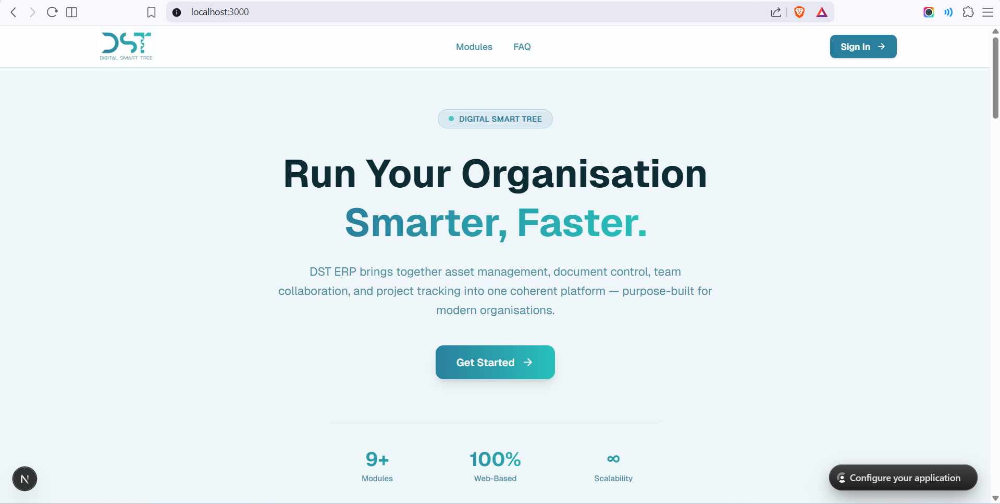
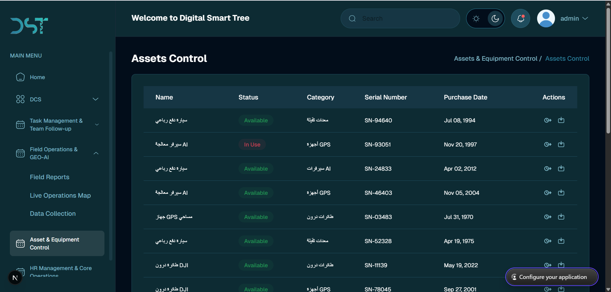

# 🚀 DST ERP System

A **modern web-based ERP system** built to centralize operations, improve team collaboration, and provide real-time visibility into business workflows.

Unlike traditional ERP systems, this project focuses on **usability, performance, and real-time data handling**, making it suitable for fast-paced operational environments.

---

## 🧠 What makes this project different?

This is not just CRUD dashboards.

The system is designed around:

* **Real-time data synchronization** using TanStack Query
* **Interactive task management (Kanban-style workflows)**
* **Map-based tracking for field operations**
* **Centralized modules (HR, documents, assets, tasks)** in one unified dashboard

---

## ✨ Core Features

### 📊 Unified Dashboard

* Central hub to monitor system activity
* Aggregated insights across tasks, assets, and operations
* Fast and responsive data handling using smart caching

---

### 🗂️ Task Management (Kanban)

* Visual task tracking with Kanban workflows
* Drag & drop between statuses (To Do → In Progress → Done)
* Improves team collaboration and workflow visibility

---

### 🗺️ Map-Based Project Tracking

* Interactive maps built with React Leaflet
* Visualize and manage field operations geographically
* Real-time location-based project insights

---

### 📄 Document Management

* Centralized document storage and organization
* Easy access to project-related files
* Structured handling of business documents

---

### 👥 HR Management

* Manage employee data within the system
* Centralized HR operations
* Integrated with overall workflow (no isolated modules)

---

### ⚙️ Asset Management

* Track and manage company assets
* Link assets to tasks and operations
* Maintain structured and accessible asset records

---

### 🔄 Advanced Server State Management

* Powered by TanStack Query
* Real-time data synchronization
* Smart caching and background refetching
* Optimistic updates for better UX
* Efficient API communication layer

---

### ✔️ Scalable Architecture

* Modular and maintainable project structure
* Reusable components for faster development
* Clean separation of concerns (UI, logic, data)

---

### 🎨 Theming & UI System

* Fully implemented dark and light modes
* Consistent design system across the app
* Focus on usability and accessibility

---

### ⚡ Performance Optimization

* Reduced unnecessary re-renders
* Optimized data fetching strategies
* Smooth loading states and transitions
* Built for scalability with large datasets

---

### 📱 Responsive & User-Friendly Design

* Works across different screen sizes
* Designed for both technical and non-technical users
* Clean and intuitive user experience

### 🌗 Dark & Light Theme System

* Fully implemented dark and light modes across the application
* Persistent theme preference for consistent user experience
* Carefully designed color system to ensure readability and accessibility in both modes
* Seamless theme switching without affecting performance

---

### 🏠 Landing Page Experience

* Modern and responsive landing page introducing the ERP system
* Clear presentation of product value and key features
* Designed with strong UI/UX principles to guide user engagement
* Optimized for performance and fast initial load
* Acts as an entry point for users before accessing the dashboard

---

## 🛠️ Tech Stack

### Frontend

* Next.js
* React
* TypeScript
* Tailwind CSS

### State & Data

* TanStack Query (React Query)

### Maps

* React Leaflet

### Architecture

* Modular component-based structure
* Scalable folder organization
* API-driven design

---

## ⚡ Performance Highlights

* Efficient data fetching with caching layers
* Reduced unnecessary re-renders
* Optimized user experience for large datasets
* Clean separation between UI and server state

---

## 🖼️ Screenshots

### Dashboard



### Kanban Board



### Map Tracking



### Landing Page



### Dark & Light Theme System


---

## ⚙️ Getting Started

### 1. Clone the repo

```bash
git clone https://github.com/abdelrhman-elnhas/DST-ERP-System.git
cd DST-ERP-System
```

### 2. Install dependencies

```bash
npm install
```

### 3. Setup environment variables

Create a `.env.local` file:

```env
NEXT_PUBLIC_API_URL=your_api_url
```

### 4. Run the development server

```bash
npm run dev
```

---

## 📁 Project Structure (Simplified)

```
src/
 ├── app/
 ├── assets/
 ├── components/
 ├── css/
 ├── fonts/
 ├── hooks/
 ├── js/
 ├── lib/
 ├── services/
 ├── store/
 ├── types/
 └── utils/
```

---

## 🔮 Future Improvements

* Real-time collaboration using WebSockets
* Notifications system
* Advanced analytics dashboards
* Role-based access enhancements

---

## 👨‍💻 Author

**Abdelrhman Elnhas**
Frontend Engineer | UI/UX Designer

Portfolio: <https://abdelrhman-elnhas.com/>

---

## ⭐ Final Note

This project focuses on building a **scalable, real-world ERP experience** with modern frontend architecture—not just static dashboards.

If you found it useful or interesting, consider giving it a ⭐
